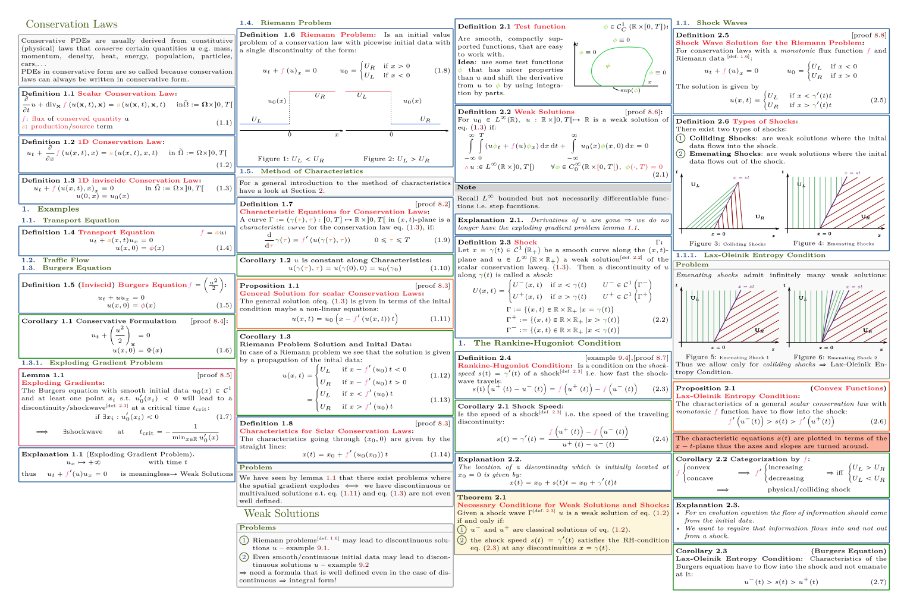

# Advanced Numerical Methods for CSE  
This repository contains a LaTeX summary that originated during the "Advanced Numerical Methods for CSE" lecture at ETH Zurich, taught by Professor Siddhartha Mishra.  
The summary covers various topics in numerical methods for science and engineering, focusing on advanced numerical methods in fluid dynamics and uncertainty quantification.

If you find this summary helpful, I would be incredibly grateful if you could consider giving it a star ⭐ on GitHub. Your support motivates me to create more content like this.

## Course Overview

- **Abstract:** This course focuses on teaching advanced topics in numerical methods for science and engineering, introducing novel algorithms, and discussing their implementation.

- **Objective:**
  - Presentation of state-of-the-art numerical methods in computational fluid dynamics.
  - Advanced implementation in C++
  - Introduction to the role of data in scientific computing, particularly in the context of uncertainty quantification (UQ).

- **Prerequisites:**
  - Familiarity with basic numerical methods (as taught in the course "Numerical Methods for CSE").
  - Knowledge of numerical methods for differential equations (as covered in the course "Numerical Methods for Partial Differential Equations").

## Appendices

This repository also includes additional summaries as submodules for your references to common equations or proofs:

### Math Submodule
- **Repository:** [Math Submodule](https://github.com/grpollak/math-cheatsheet)
- **Description:** 
This submodule provides a comprehensive summary of basic mathematical concepts and equations.  
The reason for adding this submodule is to be able to reference common equations and proofs such as "Cauchy-Schwarz Inequality" for example 
without to go into detail.
It covers a wide range of mathematical topics and is simply added for convenience.

### Machine Learning Submodule
- **Repository:** [Machine Learning Submodule](https://github.com/grpollak/ml-cheatsheet)
- **Description:** This submodule offers a condensed summary of machine learning concepts and techniques, which can be valuable for applications in computational fluid dynamics and uncertainty quantification. Machine learning plays a crucial role in data-driven scientific computing, and this submodule provides a quick reference for related topics.

Feel free to explore these submodules to enhance your understanding of the materials covered in this repository.

For more details and in-depth explanations on the main topics, please refer to the [LaTeX summary/cheat sheet](link_to_your_latex_summary.pdf) provided in this repository.

## Table of Contents

### 1. Conservation Laws
- Examples
- Transport Equation
- Traffic Flow
- Burgers Equation
  - Exploding Gradient Problem
- Riemann Problem
- Method of Characteristics

### 2. Weak Solutions
- Why do we need weak solutions
- The Rankine-Hugoniot Condition
- Shock Waves
  - Lax-Oleinik Entropy Condition
- Problems with weak solutions
- Rarefaction Waves
- Entropy Solutions
  - Properties of Entropy Solutions
    - Lp -bound on entropy solutions
    - L2-Norm
    - L1-Norm
    - Lp-Norm
  - Maximum Principle
  - Total Variation Diminishing
  - Monotonicity Preservation

### 3. Finite Volume Methods
- Properties of Schemes
- The CFL Condition
- Conservative Schemes
- Consistent Schemes
- Discrete Maximum Principle
- Discrete Total Variation Diminishing Property
  - Bounded Variation
  - Harten’s Lemma
- Monotonicity Preserving Schemes
  - Monotone Finite Volume Methods
- MCC Schemes
  - Exact Riemann Solvers
  - Godunov Method
  - Approximate Riemann Solvers
    - Linearized Riemann Solvers/Roe Schemes
      - Arithmetic Roe Average
      - Murman Roe Scheme
    - Central/HLL Schemes
      - Lax-Friedrichs Scheme
      - Rusanov Scheme
      - Enquist-Osher Flux
- Lax-Wendroff Scheme
- REA-Algorithms
  - Reconstruction
  - Approximate Reconstruction
    - Constraints
  - Limiters
    - Minmod Limiter
    - Superbee Limiter
    - MC Limiter
  - TVD REA Schemes
- Higher Order Time Schemes
  - Semi-Discrete Schemes
    - Heun’s Method
  - Properties

### 4. Systems of Conservation Laws
- Linear System of Conservation Laws
  - Types of Linear Systems
  - Properties of Schemes
    - Discrete Total Variation Diminishing Property
  - Decoupling of Linear Systems
    - Riemann Problems
      - FVM Scheme
        - CFL Condition
        - Exact Fluxes
- Godunov Flux
- Approximate Fluxes
  - Central Fluxes
- Higher Order Schemes
  - Reconstruction
  - Higher Order in Time

### 5. Non-Linear Systems of Conservation Laws
- Weak Solutions
  - The Rankine-Hugoniot Condition
- Simple Solutions
  - Contact Discontinuities
  - Rarefactions
  - Shock Waves
  - Entropy Conditions
    - Lax Entropy Condition
- Summary
- General Riemann Problems
- Linearized Riemann Solvers/Roe Schemes
  - Properties of Linear Approximations
  - Choices for the Linearized Flux
    - Arithmetic Average
    - Roe Matrices
  - Schemes
    - Roe’s Scheme
    - Harten’s Entropy Fix
- Central/HLL Schemes
  - Two Wave Solver
    - Lax-Friedrich’s Scheme
    - Rusanov Scheme
    - HLL
    - Einfeldt
  - Three Wave Solver
    - HLL-3/HLLC Solver

### 6. Proofs
- Conservation Laws
- Weak Solutions
- Finite Volume Methods
- Higher Order Schemes
- Systems of Conservation Laws
- Non-linear Systems of Conservation Laws

---

If you find any typos or errors or have suggestions for improvements, please don't hesitate to open an issue or make a pull request.
Your feedback is highly appreciated!

For any questions or clarifications, don't hesitate to [contact me](mailto:pollakgeorg@yahoo.com).

Enjoy your studies!
